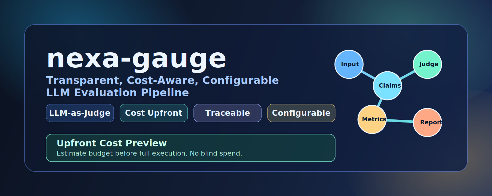

<p align="center">
  
</p>

# neXa-gauge

[](https://github.com/Sardhendu/nexa-gauge/actions/workflows/ci.yml)
[](LICENSE)
[](pyproject.toml)


A graph-based evaluation toolkit for LLM and RAG systems with repeatable quality checks, upfront cost visibility, and clean per-case outputs for analysis.


*  Graph-native evaluation flow (scan -> claims -> metrics -> eval)
*  Cost visibility before runtime with estimate-first execution
*  Cache-aware runs to avoid duplicate spend and recomputation
*  Coverage across relevance, grounding, redteam, GEval, and reference scoring
*  Production-friendly CLI for run, estimate, and cache management
*  Scales with control across utility and metric nodes
*  Bring your own model: Ollama support comming!!

## Install

### PyPI (recommended)

```bash
pip install nexa-gauge
```

With Hugging Face adapter support:

```bash
pip install "nexa-gauge[huggingface]"
```

### From source (development)

```bash
git clone git@github.com:Sardhendu/nexa-gauge.git
cd nexa-gauge
pip install -e .
```

## Quick Start

```bash
# set your provider key
export OPENAI_API_KEY="<your-key>"

# inspect CLI
nexagauge --help

# estimate first
nexagauge estimate grounding --input sample.json --limit 5

# run and write reports
nexagauge run eval --input sample.json --limit 5 --output-dir ./report
```

## CLI Overview

- `nexagauge run <target_node> --input <source> [flags]`
- `nexagauge estimate <target_node> --input <source> [flags]`

Most-used flags:
- data: `--input`, `--adapter`, `--split`, `--start`, `--end`, `--limit`
- model routing: `--model`, `--llm-model`, `--llm-fallback`
- cache: `--force`, `--no-cache`, `--cache-dir`
- execution: `--max-workers`, `--max-in-flight`, `--continue-on-error`
- debug: `--debug` (enables node logs; hides progress bar)
- output (`run`): `--output-dir`

## Node Topology

Canonical nodes:
- `scan`
- `chunk`
- `claims`
- `dedup`
- `geval_steps`
- `relevance`
- `grounding`
- `redteam`
- `geval`
- `reference`
- `eval`
- `report`

Typical paths:
- `grounding`: `scan -> chunk -> claims -> dedup -> grounding`
- `relevance`: `scan -> chunk -> claims -> dedup -> relevance`
- `geval`: `scan -> geval_steps -> geval`
- `eval`: full graph execution and aggregation

## Configuration

See `.env.example` for environment settings.

Minimum for LLM-backed runs:
- `OPENAI_API_KEY` (or alternative provider key)
- `LLM_MODEL` (default available)

Per-node overrides are supported:
- `LLM_{NODE}_MODEL`
- `LLM_{NODE}_FALLBACK_MODEL`
- `LLM_{NODE}_TEMPERATURE`

## For Maintainers

```bash
uv sync
make lint
make test
make ci
```

Releases are automated with `release-please`:
- use Conventional Commit PR titles (`feat:`, `fix:`, `deps:`, `chore:`, etc.) so merged commits are parseable
- if using merge commits, ensure the merge message includes a conventional title (or use squash merge with a conventional PR title)
- a `Release PR` is created/updated automatically and auto-merged after required checks pass
- release bump scope is repo-level (`nexa-gauge` root version), not every package-level file
- publish runs from `.github/workflows/release.yml` after release creation

Build distributions:

```bash
uv build
```

Expected artifacts:
- `dist/nexa_gauge-<version>-py3-none-any.whl`
- `dist/nexa_gauge-<version>.tar.gz`

## Project Standards

- License: [MIT](LICENSE)
- Security policy: [SECURITY.md](SECURITY.md)
- Contributing guide: [CONTRIBUTING.md](CONTRIBUTING.md)
- Code of conduct: [CODE_OF_CONDUCT.md](CODE_OF_CONDUCT.md)

## Documentation

- [docs/get-started.md](docs/get-started.md)
- [docs/architecture.md](docs/architecture.md)
- [docs/cli-code-flow.md](docs/cli-code-flow.md)
- [docs/PRODUCT_SUMMARY.md](docs/PRODUCT_SUMMARY.md)
