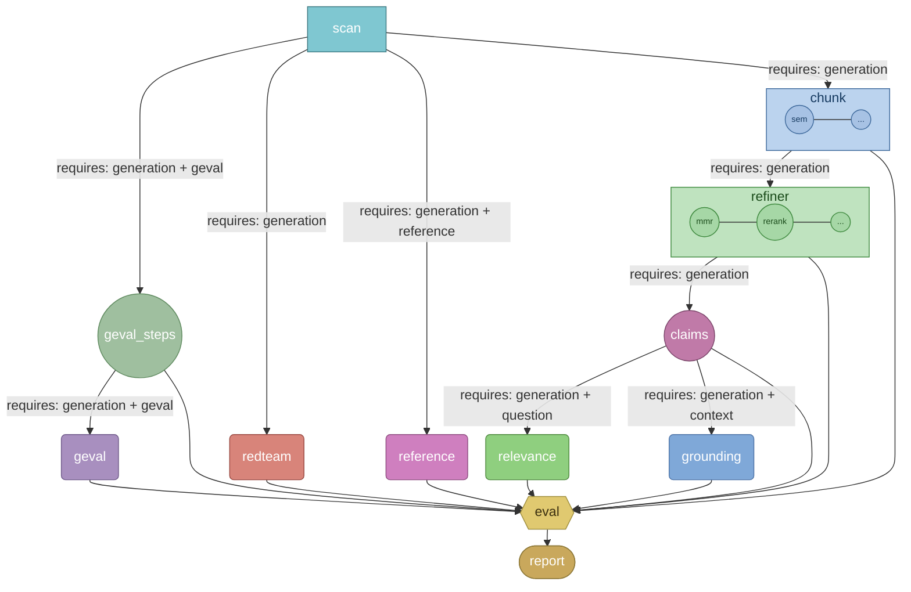

# nexa-gauge Architecture

nexa-gauge is a CLI-first evaluation engine for LLM outputs. Execution is driven by a typed node topology, a cache-aware runner, and topology-driven report projection.

Source of truth for node dependencies and input gating: `packages/nexagauge-graph/ng_graph/topology.py`.

## Runtime Components

- `ng_cli` - command entrypoint (`run`, `estimate`), dataset selection, model routing overrides.
- `adapters` - input ingestion from local files and Hugging Face datasets.
- `ng_graph.runner` - ordered/parallel execution, node-level caching, streaming outcomes.
- `ng_graph.graph` + `ng_graph.nodes.*` - node implementations.
- `ng_graph.nodes.report` - topology-driven report projection from final state.

## Top-Down Pipeline Diagram

- Built from `PIPELINE` in `topology.py`, with strategy containers for `chunk` and `refiner`.
- Solid edges show primary graph flow.
- Inner links inside containers show available strategies (one selected at runtime).

Shape key:

- Rectangle group — strategy family (`chunk`, `refiner`)
- Circle — utility leaf node / strategy option
- Rounded rectangle — metric node (`is_metric`)
- Hexagon — `eval` (the single join every branch funnels through)
- Stadium — `report` (terminal aggregation)
- Rectangle — `scan` (preflight)

Edge labels encode the target node's `requires_*` input gates. Edges into `eval` are unlabeled because `eval` itself has no input requirements.

## Execution Rules

- Dependencies and requirement labels are derived from `PIPELINE` node specs (direct-parent edges).
- `chunk` and `refiner` are strategy families; one option is selected at runtime via CLI (`--chunker`, `--refiner`).
- `eval` aggregates metric branches plus utility prerequisites; `report` depends on `eval`.
- The eligibility subgraph mirrors `scan`-produced presence flags that gate node execution.
- At runtime, the CLI runner can append `report` for non-report targets; this diagram focuses on architecture dependency flow.

## Data and Output Contracts

Input normalization (`scan`) maps common aliases into canonical `inputs` fields:

- `case_id`, `generation`, `question`, `context`, `reference`, `geval`, `redteam`

Core runtime state includes:

- control: `target_node`, `execution_mode`, `llm_overrides`
- strategy control: `chunker`, `refiner`, `refiner_top_k`
- artifacts: `generation_chunk`, `generation_refined_chunks`, `generation_claims`, `geval_steps`, metric outputs
- bookkeeping: `estimated_costs`, `node_model_usage`

Report shape is topology-driven in `ng_graph.nodes.report`: sections are included by non-`None` `state_key` values from `PIPELINE`.
