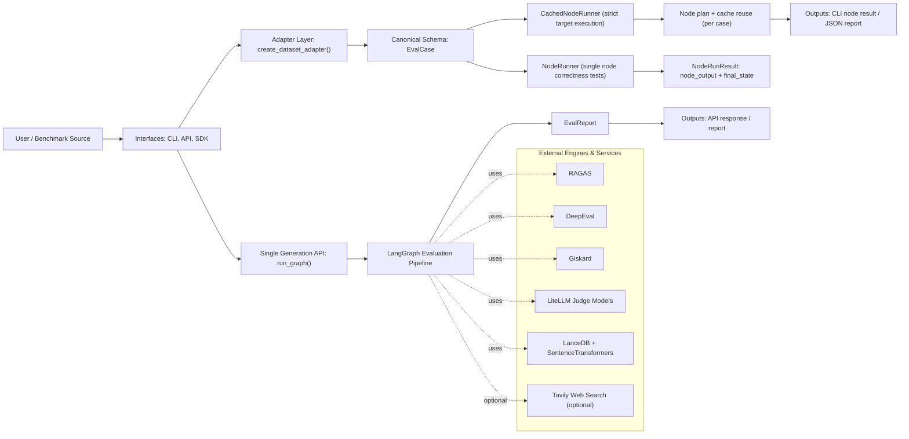
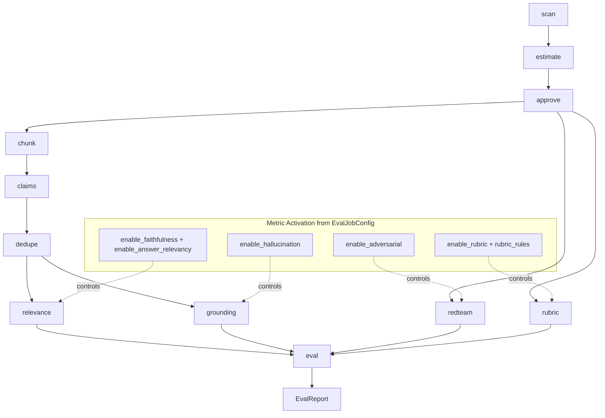
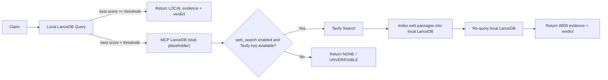
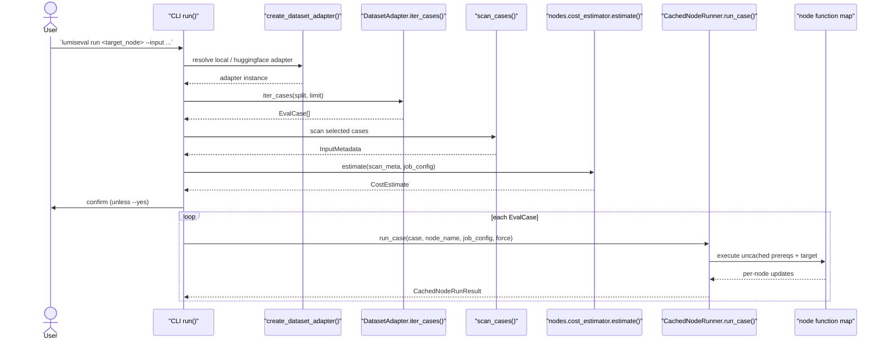
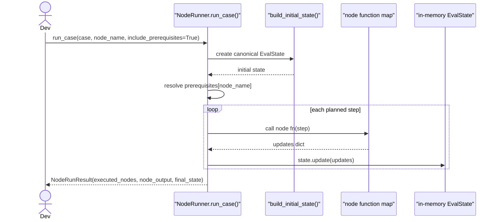

# LumisEval Architecture (Current V1 Code)

This document reflects the current implementation across:
- `apps/lumiseval-cli`
- `apps/lumiseval-api`
- `packages/lumiseval-graph`
- `packages/lumiseval-ingest`
- `packages/lumiseval-evidence`
- `packages/lumiseval-core`

Core evaluation intent is split into two top-level quality dimensions:
- `retrieval_score`: did we retrieve the right evidence safely and sufficiently?
- `answer_score`: is the generated answer correct, relevant, and safe?

`composite_score` is currently the simple average of available top-level scores.

## 1) High-Level Architecture

## 2) Medium-Level Architecture

### 2.1 Graph Node Flow

### 2.2 Evidence Routing Cascade

## 3) Low-Level Function Call Flow

### 3.1 Full Dataset Through CLI Strict Target

### 3.2 Single-Node Correctness Testing Path

## Scoring Model (Current)

- Inputs to eval:
  - `relevance_metrics`
  - `grounding_metrics`
  - `redteam_metrics`
  - `rubric_metrics`
  - `claim_verdicts` from evidence routing
- Derived metric:
  - `evidence_support_rate` = proportion of claims with `SUPPORTED` verdict
- Partitioning:
  - Retrieval bucket: metrics with category `RETRIEVAL` + `evidence_support_rate`
  - Answer bucket: metrics with category `ANSWER`, excluding `vulnerability_*` marker metrics
- Warnings:
  - `vulnerability_*` results and metric errors are surfaced as warnings
- Composite:
  - `composite_score = avg([retrieval_score, answer_score] where present)`

## Canonical Dataset Contract for V1

All dataset sources are normalized to `EvalCase`:
- `case_id`
- `generation` (required)
- `question` (optional)
- `ground_truth` (optional)
- `context` (optional list)
- `reference_files` (optional list)
- `rubric_rules` (optional list)
- `metadata` (free-form)

This contract is what makes both flows modular:
- strict-target dataset execution (`CachedNodeRunner` via CLI `run`)
- isolated node validation (`NodeRunner`)

## Current Gaps (Known in Code)

- MCP retrieval is a stub in `retrieve`.
- API remains synchronous (`POST /jobs` executes inline).
- `cost_actual_usd` tracking is not fully wired from real LLM usage yet.
- Persisted jobs/reports storage is not implemented yet.
