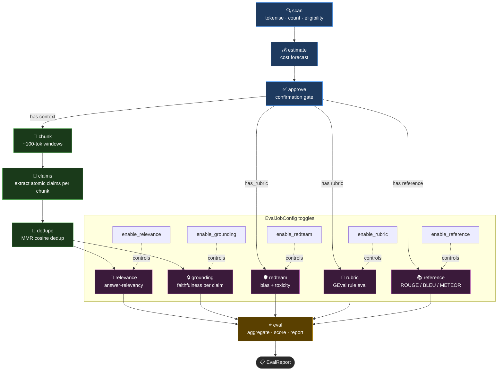

When I run lumiseval run reference --input sample.json

this should simply run scan, estimate, approve and then reference node.

now the sequence of excution works liek scan-> estimate-> approve-> reference
but I see A Estimated cost: $0.0209. Proceed? [y/N]:
this is not correct because the cost should be zero as reference node is zero cost node.

similarly for grounding node, it should run scan, estimate, approve, claims, dedupe and then grounding node.
The grounding node should show a total cost of claim + grounding node cost.
Estimated cost: $0.002288 Proceed? [y/N]:


I suppose there is a bug int the code that shows the total combined cost for each node run. Lets plan to fix this


I plan to build a graph based eval pipeline that can run as a CLI and as a api call. When the user uses the CLI they need to provide the file, for experimentation I have added a experimentation file called sample.json.
A simple request looks like 
```
{
    "case_id": "transformer-architecture-technical",
    "question": "Explain the Transformer architecture and why it replaced RNNs for NLP tasks.",
    "generation": "The Transformer, i....",
    "rubric": [
      "Is the response within 100 words",
      "The response must explain what self-attention is.",
      "The response must mention positional encodings.",
      "The response must explain why RNNs are slower or harder to train.",
      "The response must not contain factual errors about the architecture."
    ],
    "reference": "The Transformer, i....",
  }
```

Different input field activates different part of the evaluation pipeline.

Now what I want to plan is the Graph itself. I want the user to have the flexibility of choosing the branch or part of graph to run. With the current implementation the graph is as follow



Now the flexibility, I am talking about is as follows.
1. if the user runs `lumiseval run eval --input sample.json` then all the nodes run, because eval is dependent on all the nodes. Independent nodes unrelated can run in parallel. For example
2. if the user runs `lumiseval run redteam --input sample.json` then (scan, estimate, approve, redteam) runs 
3, if the user runs `lumiseval run relevance --input sample.json` then (scan, estimate, approve, chunk, dedupe, relevance) runs .
4. if the user runs `lumiseval run reference --input sample.json` then (scan, estimate, approve, reference) runs.
5. Each node caches data. 

    Case1: say I run `lumiseval run relevance --input sample.json` on 10 data points. the cost estimate should include cost(claim) + cost(relevance). Additionally, the data should be cached. Now say I run `lumiseval run grounding --input sample.json`, since they have common path for the same data, I dont want recompute, `chunks`, `claims`, `dedupe`, but use the cache. Additionally this time the the cost_estimate should only cost(relevance), as we had computed cost(claim) before. So cost and data needs to be cached together

    Case 2: say I run `lumiseval run relevance --input sample.json` on 10 data points. the cost estimate should include cost(claim) + cost(relevance) for this 10 data points. Say now I added 5 more data points and run `lumiseval run relevance --input sample.json` again then the new cost should not include the cost of previously run 10 data points.


What I care about:
1. parallel execution of non dependent nodes.
2. A simple yet flexible implementation of the graph structure and dependency, LangGraph if it makes sense given the caching and flexiblity use cases.
3. NO error handling, let it fail
4. Only handling the CLI use case for now.