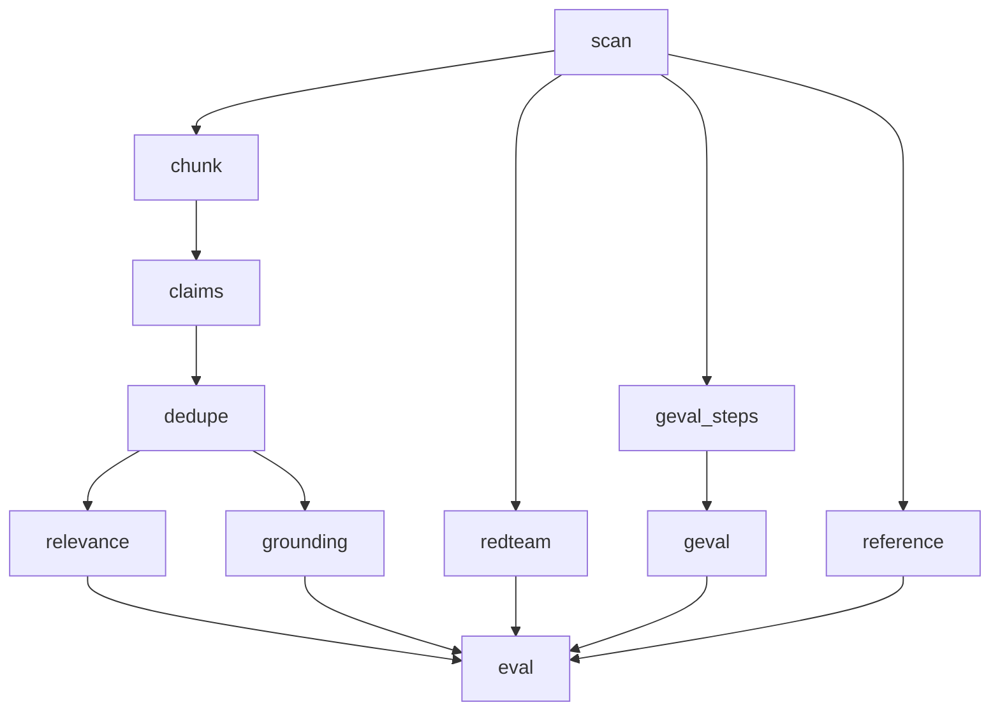

# Pipeline Nodes (Current)

Canonical graph (hard-cut GEval-only, no legacy aliases):

Execution examples:

- `lumiseval estimate grounding --input sample.json`
  - scans dataset, builds cache-aware plan, prints delta cost
  - does not execute graph nodes

- `lumiseval run grounding --input sample.json`
  - runs strict dependency path: `scan -> chunk -> claims -> dedupe -> grounding`
  - reuses node cache where available

- `lumiseval run eval --input sample.json`
  - runs full dependency closure and aggregation
  - metric siblings (`relevance`, `grounding`, `redteam`, `geval`, `reference`) can execute in parallel
